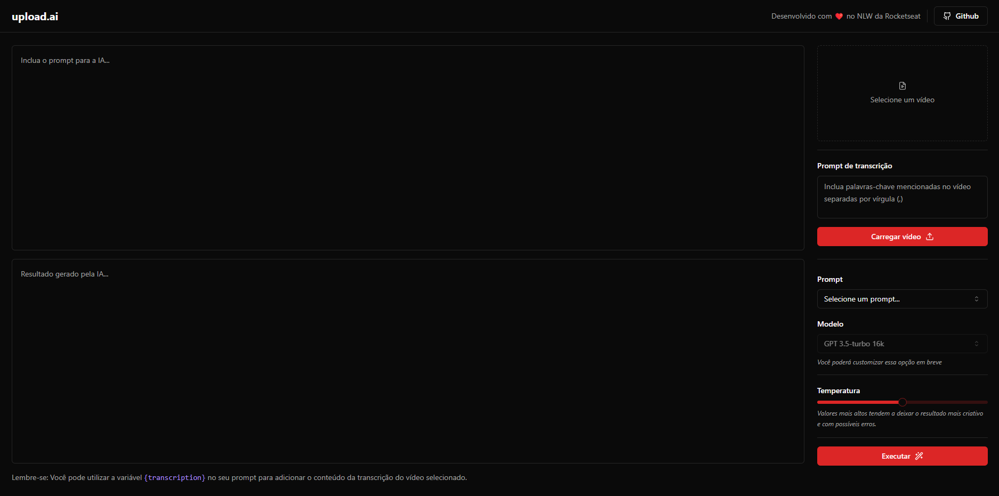

    

## :rocket: Tecnologias

Foram usadas as seguintes tecnologias:

- [React.js](https://pt-br.reactjs.org)
- [Vercel AI](https://sdk.vercel.ai/docs)
- [Open AI](https://platform.openai.com)
- [FFmpeg](https://ffmpegwasm.netlify.app)
- [Web Assembly](https://webassembly.org)
- [Shadcn](https://ui.shadcn.com)
- [Tailwind](tailwindcss.com)
- [Prisma](https://www.prisma.io)
- [Fastify](https://fastify.dev)

## :computer: Projeto

O upload-ai é uma plataforma para gerar títulos e descrições de vídeos baseado na transcrição do vídeo. Mas além disso o usuário pode escolher o que quer que seja gerado, como um trecho ou uma explicação sobre algo falado no vídeo.

## :thinking: Como rodar o projeto?

1. Instalar as dependências na pasta `server` e na pasta `web` com `npm i`

2. Entrar na pasta server e rodar `npm run dev`

3. Entrar na pasta web e rodar `npm run dev` | O `server` deve permanecer rodando
